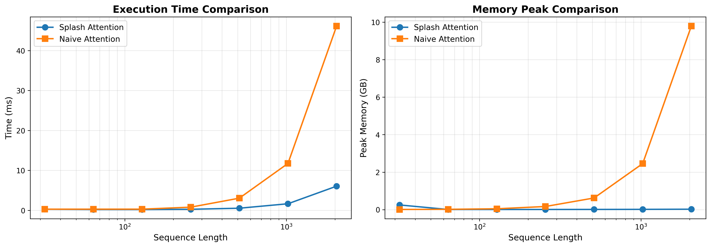

# About

Splash Attention is a specialized implementation of the Sparse Attention mechanism introduced in the [SPARTAN](https://arxiv.org/abs/2411.06890) paper.
It is built using [Helion](https://helionlang.com/index.html), a high-performance domain-specific language (DSL) and compiler for tensor programs.

Sparse Attention is particularly useful for learning interpretable representations.
An example use case is:

> Florent Draye, Anson Lei, Hsiao‑Ru Pan, Ingmar Posner, Bernhard Schölkopf.
> *Sparse Attention Post‑Training for Mechanistic Interpretability.*
> [arXiv preprint arXiv:2512.05865 (2025)](https://arxiv.org/abs/2512.05865).


# Benchmark



# Requirements

The requirements are the same as PyTorch Helion.

* PyTorch 2.9 or later
* Helion 0.2.6 or later

# Installation

```bash
pip install git+https://github.com/hrpan/splash_attention.git
```

# Example Usage
```python
import torch
from splash_attention import splash_attention

# input shape: (batch size, heads, seq len, head dim)

q = k = v = torch.rand((1, 16, 16, 64), device='cuda')

# inputs: 
# Q, K, V,
# bias_gate: float (usually a positive float to ensure the gates are open at initialization),
# causal: bool (causal attention),
# sample: bool (Gumbel sampling, True for training, False for inference),
# return_map: bool (whether to return the sparsity map)

out, p_mask, adj = splash_attention(q, k, v, 0., True, False, False)

# p_mask: average of the sigmoid of the logits
# adj: the adjacency map
```
